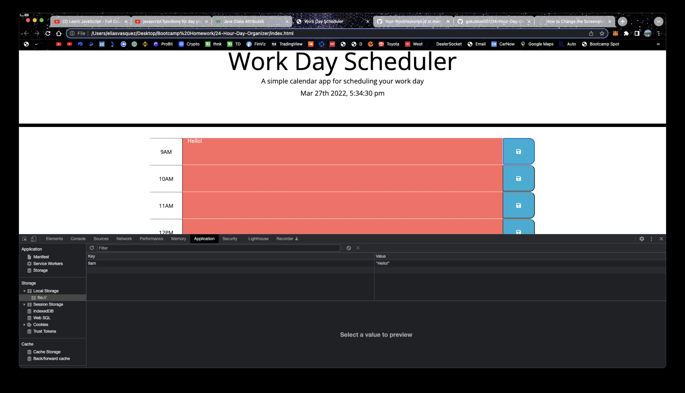

# 24-Hour-Day-Organizer

> As a person with a busy schedule I will be able to add important events to a daily planner so I can manage my time effectively!

---

### Deployment

- [Deployment](https://gokublue007.github.io/24-Hour-Day-Organizer/)

---

## Description

I will be using a daily planner to create a schedule. The current day is displayed at the top of the calendar.
I am presented with timeblocks for standard business hours and will be able to view the timeblocks for that day each timeblock is color coded to indicate whether it is in the past, present, or future
When I click into a timeblock I can enter an event and I can click the save button for that timeblock the text for that event is saved in local storage when I refresh the page the saved events persist

#### Technologies

- Html
- CSS
- JavaScript
- Moment
- Bootstrap

[Back To The Top](#read-me-template)